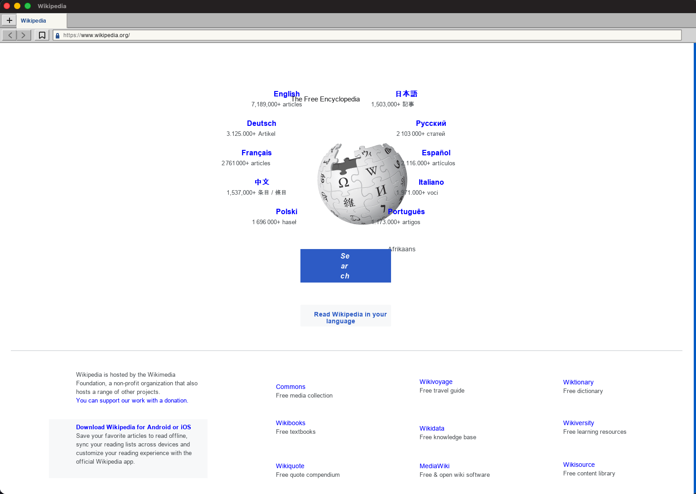
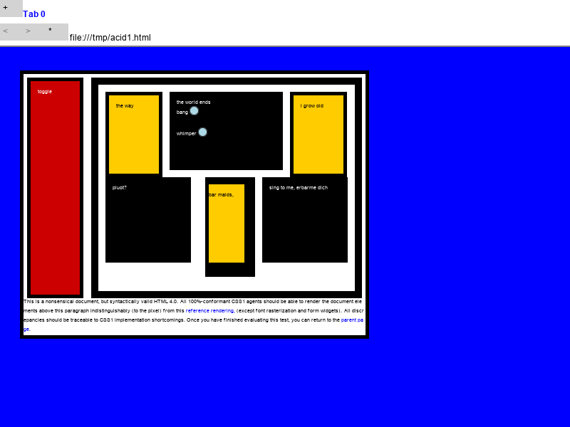
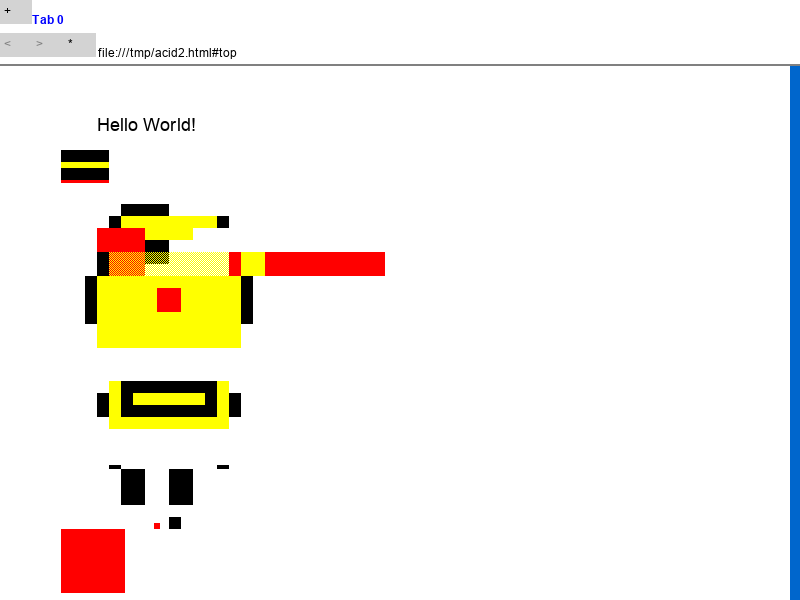
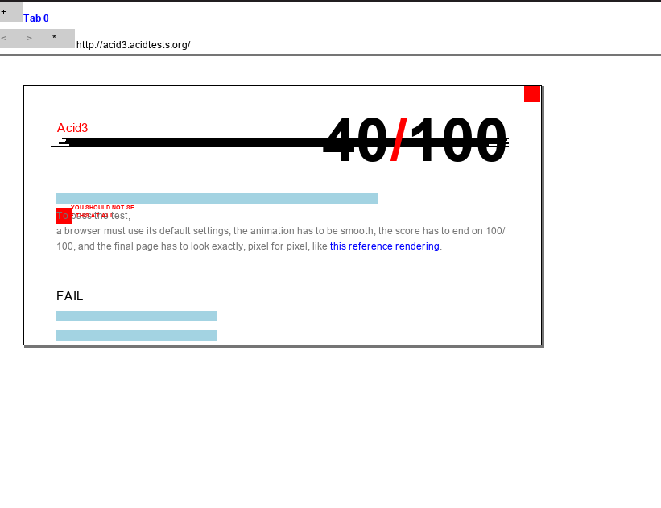

# zibra

A web browser, almost written in pure Zig.

The core of the implementation was built by following the [Web Browser Engineering](https://browser.engineering/) book.



## Usage

You'll need Zig installed.

Clone the project:

```sh
git clone https://github.com/braheezy/zibra.git
```

To build the project, run:

```sh
zig build
cp zig-out/bin/zibra .
```

`zibra` (optionally) takes one URL and displays the result in a window:

```sh
zibra https://example.org
```

Run without a URL for a default HTML.

## Development

Development commands:

```sh
# build and run
zig build run -- https://example.com
# Inspect individual document-pipeline stages without an interactive browser
zig build run -- --dump-dom https://example.com
zig build run -- --dump-style https://example.com
zig build run -- --dump-layout https://example.com
zig build run -- --dump-display-list https://example.com
# Run tests
zig build test
# Run a focused subsystem while iterating
zig build test-document
zig build test-render
zig build test-network
zig build test-script
zig build test-browser
# Compare deterministic style, layout, and display-list output
zig build test-pipeline
# Run every portable build, test, formatting, pipeline, server, and docs check
zig build verify
# Capture and compare the windowless macOS screenshot fixtures
zig build test-screenshot
# Inspect a large-screen layout instead of the default 800x600 capture
zig build run -- --viewport 2560x1440 --screenshot /tmp/wide.png https://www.wikipedia.org/
# Capture an active page after a bounded delay (useful for timers/animations)
zig build run -- --screenshot /tmp/acid3-slice.png --screenshot-after-ms 3000 \
  https://acid3.acidtests.org/
```

See [Architecture and lifetimes](docs/architecture-and-lifetimes.md) for the source map, ownership contracts, threading model, and known lifetime risks.

## [Acid Tests](https://www.acidtests.org/)

[Acid1:](https://www.w3.org/Style/CSS/Test/CSS1/current/test5526c.htm)


[Acid2:](http://acid2.acidtests.org/#top)


[Acid3:](http://acid3.acidtests.org/)


